# Laravel based booking + CRM for Salon Bliss

<p align="center"></p>

# Table of contents

- [About the project](#about-the-project)
  - [Technologies Used](#technologies-used)
  - [Project Document](#project-document)
- [Features](#features)
- [Using the queue](#using-the-queue)
- [Installation](#installation)


## About the project

<figure>
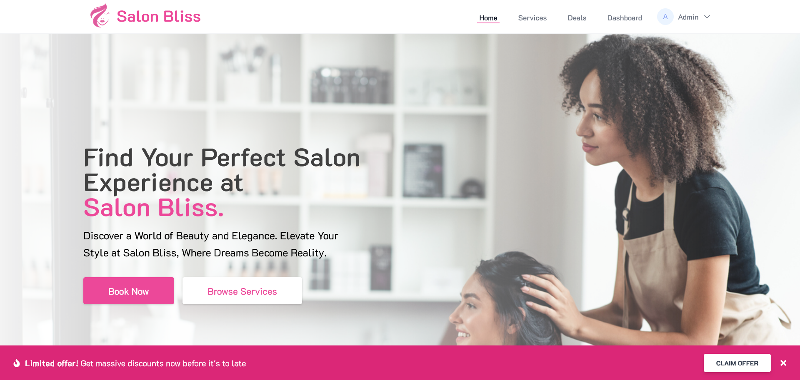
<figcaption align="center"><i>Home Page</i></figcaption>
</figure>
<br /><br />

This project is a booking and CRM system for Salon Bliss, a fictional hair salon. 

Managing Users, Services, Locations, Cart for customers, Appointment Booking functionality, Multiple categories, locations for the salon, use of Email
notifications, sending emails and capturing the views of the users,
appointment management, analytics data display are some of the features of this project.

If you want to run this project locally, follow the [installation instructions](#installation).

### Technologies Used
The system is built with the [TALL Stack](https://tallstack.dev/)
- [Tailwind CSS](https://tailwindcss.com/)
- [Alpine.js](https://alpinejs.dev/) 
- [Laravel](https://laravel.com/) 
- [Livewire](https://laravel-livewire.com/)

For authentication scaffolding the project uses [Laravel Jetstream](https://jetstream.laravel.com/).

The project uses Laravel's [Queued Jobs](https://laravel.com/docs/10.x/queues) to send emails and record analytics data.

For testing of the email sending, [Mailtrap](https://mailtrap.io/) was used.

### Project Document

This was developed for the requirements of a Server Side Programming module.
The assignment document is available here: [SSP2_FINAL2_CB010454.pdf](SSP2_FINAL2_CB010454.pdf)

## Features

The following are some of the features of the project. To provide a better understanding of the features some screenshots are also provided where necessary.

**✅ Use of middleware to grant role based access to routes**

A middleware was created to validate the role of the user and grant access to the routes. 
When using the middleware the name of the required roles are passed seperated by a comma.
The routes associated for the users based on the roles are grouped in the web.php file.

**🏬 Location Management**

The admin user can create, edit and delete locations. These locations are used when booking an appointment. 
For the purpose of the assignment, only one appointment per time slot is possible in the system.

<figure>
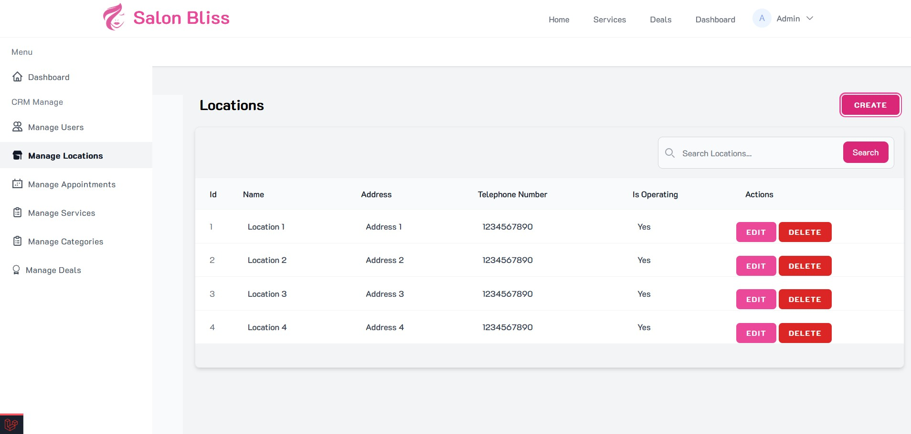
<figcaption align="center"><i>Locations Manage Page</i></figcaption>
</figure>
<br /><br />

**👤User management**

The management of the customers and employees is done by the admin user. 
Admin user can create, edit and delete employees. There is an option that allows the admin to suspend a user.


<figure>
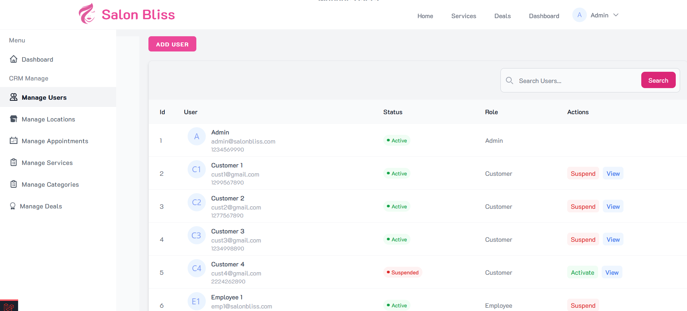
<figcaption align="center"><i>Manage Users</i></figcaption>
</figure>
<br /><br />


**💇 Categories and Service management**

Admin and employee users can create, edit and delete service categories. 
Admin and employee users can create, edit and delete services. When creating a service a category must be selected. 
There are some other details such as the price, description, image, benefits, allegens, cautions, and aftercare tips.

<figure>
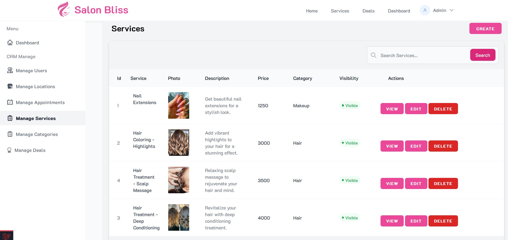
<figcaption align="center"><i>Manage Services</i></figcaption>
</figure>
<br /><br />

When a new service is created, the customers are notified by email.
This is done using a queued job.

<figure>
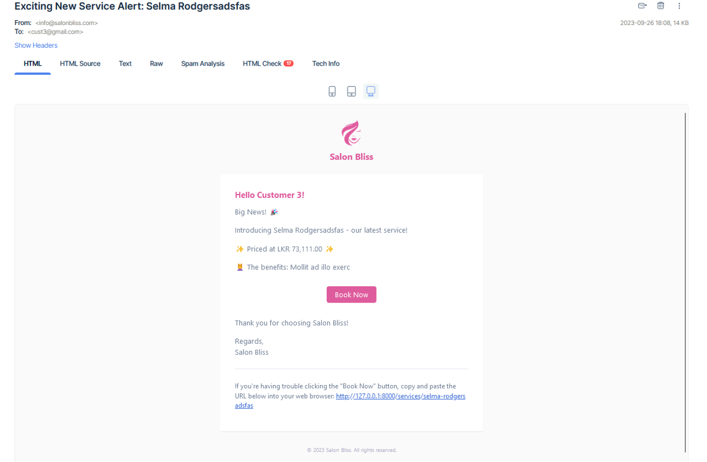
<figcaption align="center"><i>New service email</i></figcaption>
</figure>
<br /><br />

**🆕 Booking an appointment**

The appointment booking is done by first adding to the cart: the customer selects the location of the
booking, and the date. The system then checks for availability and disables and grey out the timeslots that are
not available. Then the customer can select a time slot and add it to the cart.

<figure>
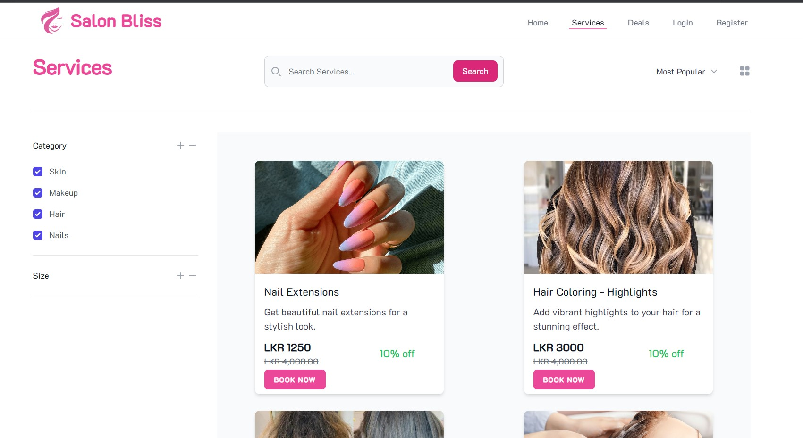
<figcaption align="center"><i>Services</i></figcaption>
</figure>
<br /><br />

The system displays the timeslots of a location that are available when the user selects the location and date.
The system disables and greys out the unavailable time slots.

_Take Note of the greyed out unavailable time slot below_
<figure>
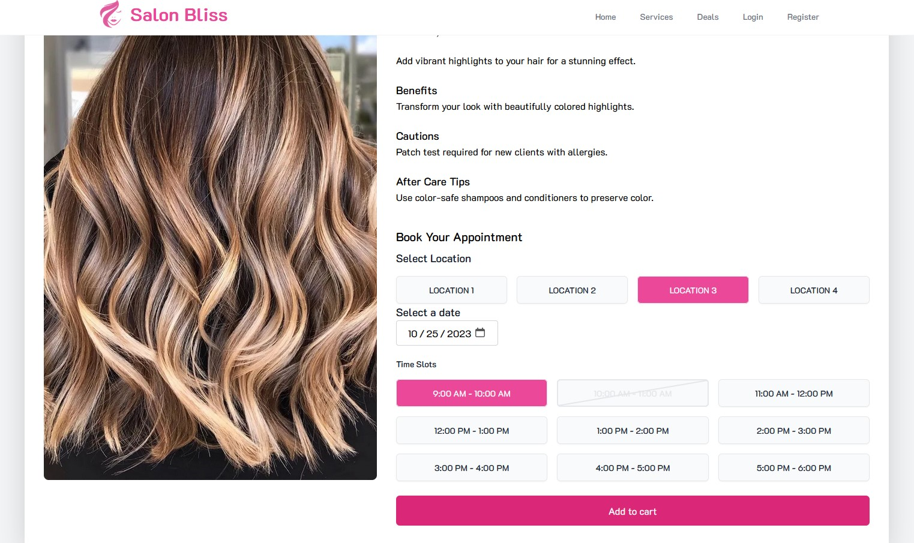
<figcaption align="center"><i>Viewing a service - Selecting Time Slots</i>
</figcaption>
</figure>
<br /><br />


**🛒 Cart**

A cart system was created for the user to add the services to the cart. It also included creation of
a pivot table called cart_services. The system checks if there are any booking for that time slot
before creation of the appointment at Checkout

<figure>
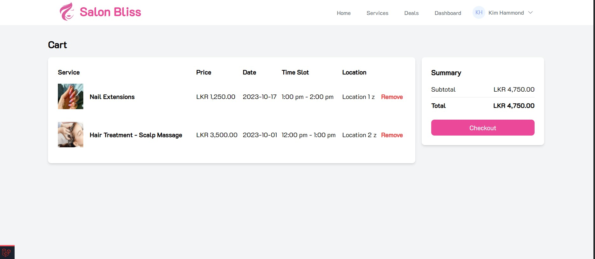
<figcaption align="center"><i>Cart</i></figcaption>
</figure>
<br /><br />

**📃 Appointment creation**

At checkout the appointment is created. Then an email is sent to the customer as a confirmation
of the booking. This email is sent using a queued job. [Check out how to start the queue in laravel](#using-the-queue)

<figure>
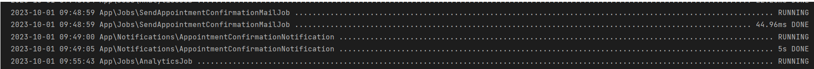
<figcaption align="center"><i>Queued jobs to send the confirmation email</i></figcaption>
</figure>
<br /><br />

<figure>
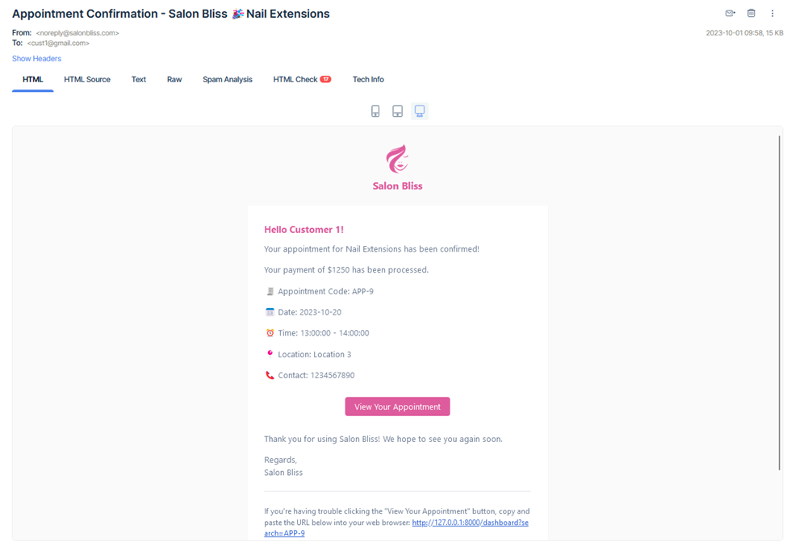
<figcaption align="center"><i>Appointment Confirmation Email</i></figcaption>
</figure>
<br /><br />

**🎯 Page view hit analytics**

The views of the pages is recorded using a queued job by resolving the AnalyticsSingleton

<figure>
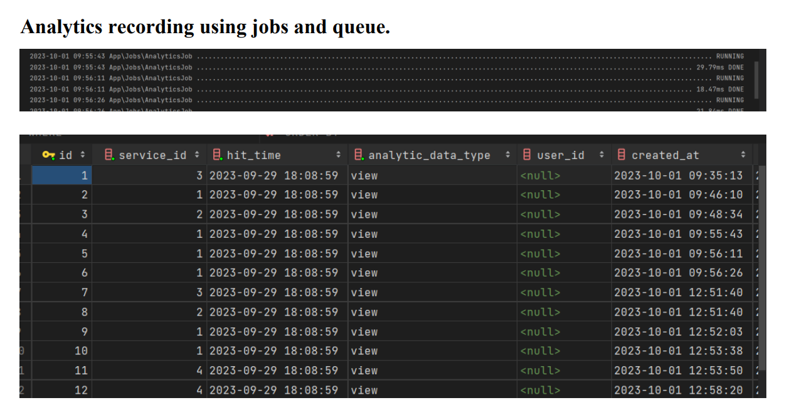
<figcaption align="center"><i>Recording Analytics using a queued job</i></figcaption>

</figure>

**🎯 View analytics of customer and services**

The staff can view the information related to the services such as the views, appointments, and
revenue. This is shown when viewing a service. The staff can also view the analytics of a customer.

<figure>
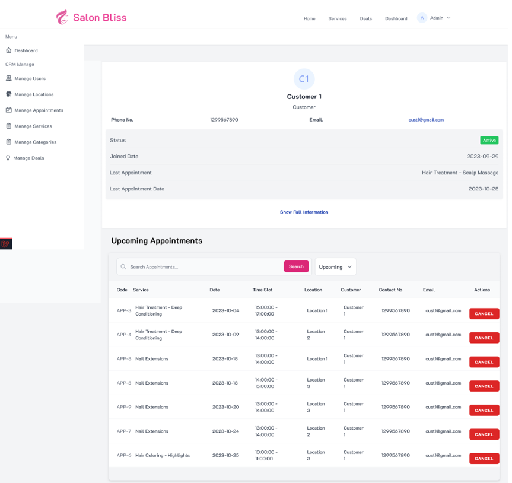
<figcaption align="center"><i>Customer Details including analytics such as last appointment and total spending</i></figcaption>
</figure>
<br /><br />

<figure>
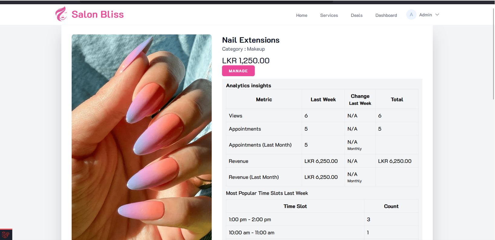
<figcaption align="center"><i>Analytics of a service</i></figcaption>
</figure>
<br /><br />

**📅 Appointment management**

The staff can manage appointments of all customers, a customer can manage their appointments.

<figure>
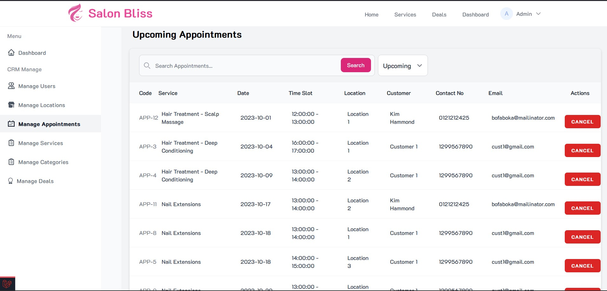
<figcaption align="center"><i>Appointment Management Page</i></figcaption>
</figure>
<br /><br />

The customer can also see the details of the appointments that they have made.

<figure>
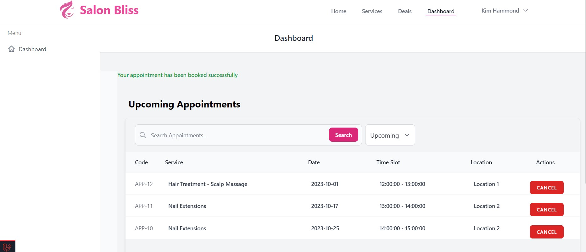
<figcaption align="center"><i>Appointment Management - Customer</i></figcaption>
</figure>
<br /><br />

A schedule for the current day and the day is shown for all the locations of the salon in the admin dashboard

<figure>
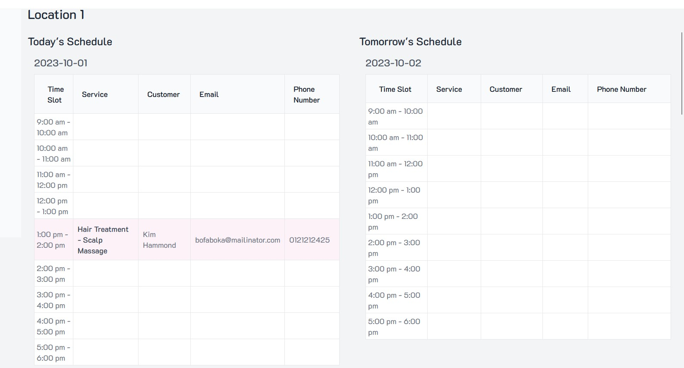
<figcaption align="center">Day schedules</figcaption>
</figure>
<br /><br />

**🧑‍💻 API Customer CRUD and Services CRUD**

The system provides an API for the create, read, update and delete of a customer. 

The system also provides an API for the create, read, update and delete of a service.

The postman collection for the API is available here: [Salon Bliss.postman_collection.json](Salon Bliss.postman_collection.json)

[//]: # (## Screenshots)

[//]: # (Below are some screenshots of the website.)

[//]: # (<figure>)

[//]: # ()

[//]: # (<figcaption align="center">Home Page</figcaption>)

[//]: # ()
[//]: # (</figure>)

[//]: # ()
[//]: # (<figure>)

[//]: # (<figcaption align="center">Admin Dashboard Page</figcaption>)

[//]: # (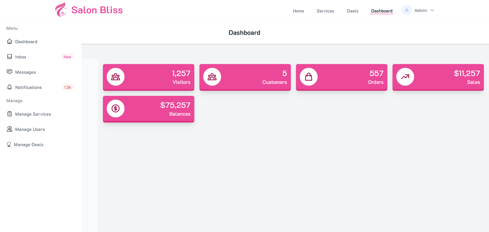)

[//]: # (</figure>)

[//]: # ()
[//]: # (<figure>)

[//]: # (<figcaption align="center">Manage Deals Page</figcaption>)

[//]: # (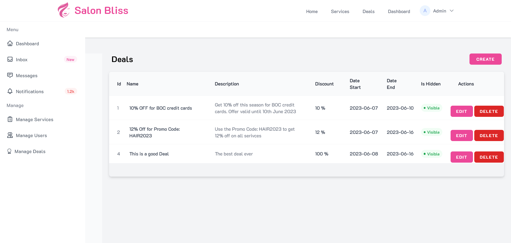)

[//]: # ()
[//]: # (</figure>)

## Using the queue

The system utilizes queued jobs for tasks such as capturing page views and sending emails.

To run the queue manually you will have to run the command
```shell
php artisan queue:listen
```

More Info: https://laravel.com/docs/10.x/queues

## Installation

The following pre-requisites are needed to run the project

-   [Composer](https://getcomposer.org/download/)
-   [Node.js](https://nodejs.org/en/download/)
-   [NPM](https://www.npmjs.com/get-npm)
-   [PHP](https://www.php.net/downloads.php)
-   [MySQL](https://dev.mysql.com/downloads/installer/) (or you can use SQLite file database)

For PHP and MySQL, [ XAMPP ](https://www.apachefriends.org/download.html) or [WAMP server](https://www.wampserver.com/en/download-wampserver-64bits/) can be used.

1.  Clone the repo

    ```sh
    git clone https://github.com/sachintha-lk/CRM-laravel
    ```

2.  Move in to the folder

    ```sh
    cd CRM-laravel
    ```

3.  Install Composer packages

    ```sh
    composer install
    ```

4.  Install NPM packages

    ```sh
    npm install
    ```

5.  Create a .env file by copying the .env.example file


6.  Generate an app encryption key

    ```sh
    php artisan key:generate
    ```

7.  Create a database and add the database credentials to the .env file

    Follow instructions from Laravel docs if you are using SQLite. https://laravel.com/docs/10.x/database#sqlite-configuration

    Note: A sqlite database file is committed to the repository you can use it by configuring the env following instructions of the above link
8.  Run the migrations

    ```sh
    php artisan migrate
    ```

9.  Run the seeders

    ```sh
    php artisan db:seed
    ```

10. Run the project

    ```sh
    npm run dev
    ```

    Keep this running and open a new terminal and run

    ```sh
    php artisan serve
    ```

11. Visit the site at http://localhost:8000

**Note:** The Admin user is created using the seeder. The default credentials are as follows:<br>
email : `admin@salonbliss.com`<br>
password : `adminpassword`

**Note**
Make sure you set up an email service provider in the env file. For testing purposes a service like  [Mailtrap](https://mailtrap.io/) can be used.

For the email and page view capture to work, [the queue should be run](#using-the-queue)

## Future Development
**This project was developed for an academic assignment, the project will be further developed in the future as a portfolio project**

If you have any suggestions create an issue on the repository.


